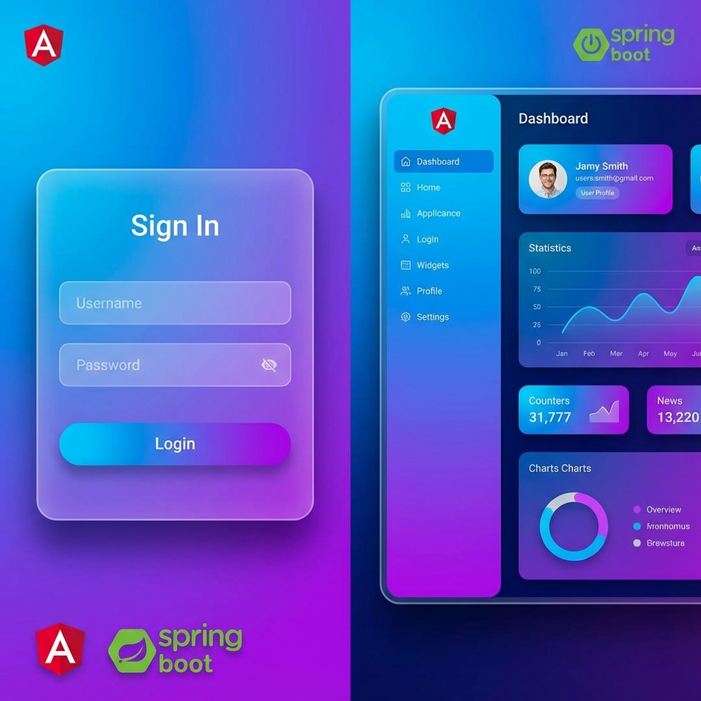
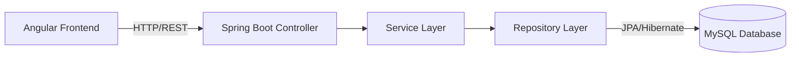

<div align="center">

# 🚀 Angular & Spring Boot Full-Stack Project


[](https://opensource.org/licenses/MIT)

**A powerful, scalable web application featuring a secure Spring Boot backend and a dynamic Angular frontend.**

[View Demo](#ui-preview) • [Documentation](#-project-structure) • [Report Bug](https://github.com/Pavankumarswamy/Angular_springboot_project/issues) • [Request Feature](https://github.com/Pavankumarswamy/Angular_springboot_project/issues)

</div>

---

## 📸 UI Preview

<div align="center">
  
</div>

---

## 📑 Table of Contents
- [✨ Key Features](#-key-features)
- [🏗 Architecture](#-architecture)
- [🛠 Tech Stack](#-tech-stack)
- [🚀 Getting Started](#-getting-started)
  - [Prerequisites](#prerequisites)
  - [Backend Setup](#backend-setup)
  - [Frontend Setup](#frontend-setup)
- [🔌 API Endpoints](#-api-endpoints)
- [📦 Project Structure](#-project-structure)
- [🤝 Contributing](#-contributing)

---

## ✨ Key Features

| Feature | Description |
|---------|-------------|
| **🔐 Secure Auth** | robust JWT-based authentication and authorization. |
| **👥 User Management** | Complete CRUD operations for user profiles. |
| **🎨 Modern UI** | Responsive material design with sleek animations. |
| **⚡ High Performance** | Optimized backend with efficient database queries. |
| **🐳 Docker Ready** | (Optional) Containerization support for easy deployment. |

---

## 🏗 Architecture

The application follows a clean **Layered Architecture**:



---

## 🛠 Tech Stack

<details>
<summary><b>Click to expand full stack details</b></summary>

### Frontend ("Prime")
- **Framework**: Angular v16
- **Styling**: CSS / SCSS
- **HTTP Client**: RxJS based
- **Build Tool**: Angular CLI

### Backend ("Certo")
- **Framework**: Spring Boot 3.x
- **Language**: Java 17
- **Database**: MySQL
- **ORM**: Hibernate & Spring Data JPA
- **Simplification**: Lombok
</details>

---

## 🚀 Getting Started

Follow these steps to get a local copy up and running.

### Prerequisites

*   **Java JDK 17+**
*   **Node.js (LTS)**
*   **MySQL Server**
*   **Git**

### Backend Setup

1.  **Clone the repo**
    ```sh
    git clone https://github.com/Pavankumarswamy/Angular_springboot_project.git
    cd Angular_springboot_project/backend
    ```

2.  **Configure Database**
    Update `src/main/resources/application.properties` with your credentials:
    ```properties
    spring.datasource.url=jdbc:mysql://localhost:3306/certo_db
    spring.datasource.username=root
    spring.datasource.password=your_password
    ```

3.  **Run the App**
    ```sh
    ./mvnw spring-boot:run
    ```
    ✅ Server starts at `http://localhost:8081`

### Frontend Setup

1.  **Navigate to frontend**
    ```sh
    cd ../frontend
    ```

2.  **Install Dependencies**
    ```sh
    npm install
    ```

3.  **Start Dev Server**
    ```sh
    ng serve
    ```
    ✅ App opens at `http://localhost:4200`

---

## 🔌 API Endpoints

| Method | Endpoint | Description |
|:---:|:---|:---|
| `POST` | `/api/v1/login` | Register a new user |
| `GET` | `/api/v1/users` | Fetch all users |

---

## 📦 Project Structure

```bash
├── backend/            # Spring Boot Application
│   ├── src/main/java   # Source code
│   └── src/test        # Unit tests
└── frontend/           # Angular Application
    ├── src/app         # Components & Services
    └── src/assets      # Static resources
```

---

## 🤝 Contributing

Contributions are what make the open source community such an amazing place to learn, inspire, and create. Any contributions you make are **greatly appreciated**.

1. Fork the Project
2. Create your Feature Branch (`git checkout -b feature/AmazingFeature`)
3. Commit your Changes (`git commit -m 'Add some AmazingFeature'`)
4. Push to the Branch (`git push origin feature/AmazingFeature`)
5. Open a Pull Request

<div align="center">
    <br/>
    Made with ❤️ by Pavankumarswamy
</div>
